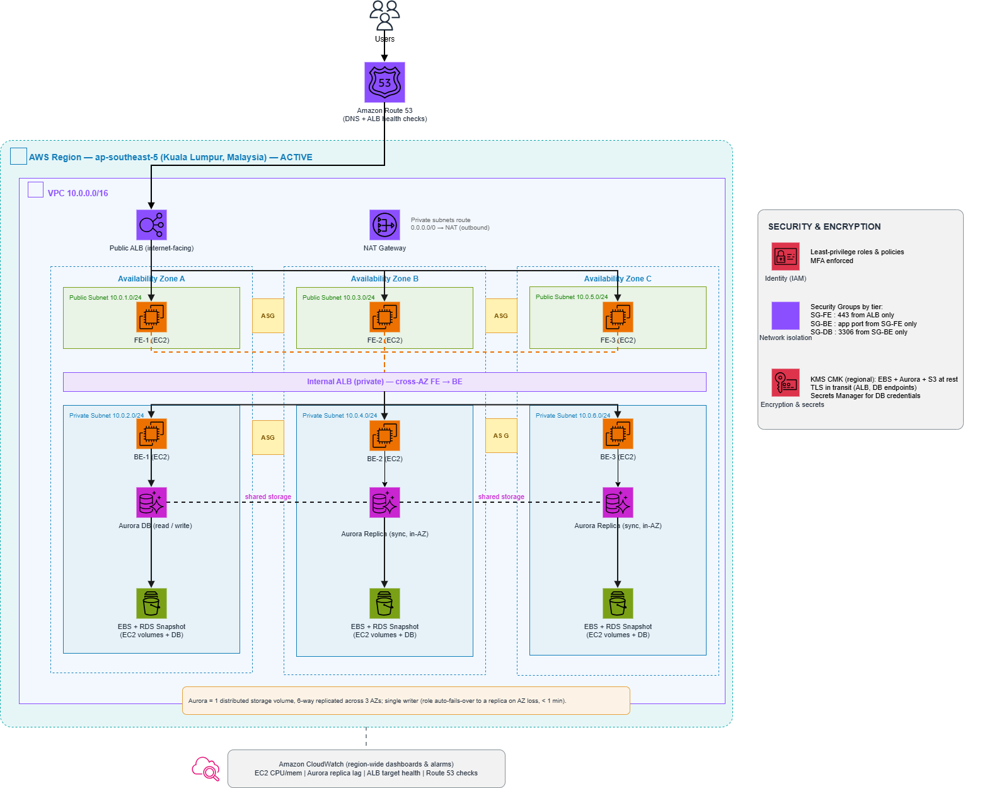

# Nexus Global Systems — AWS DR (single-region, multi-AZ HA)

Terraform for a **single-region, multi-AZ high-availability** stack on AWS in
**Kuala Lumpur (`ap-southeast-5`)**. This is the AWS port of the
[Nexus DR project](../nexus) originally built on Alibaba Cloud — same design
pattern, AWS services.

> **DR-constrained:** AWS has no Johor region, so this build keeps the workload
> resilient **within one region across 3 Availability Zones**. Disaster recovery
> here comes from Multi-AZ Aurora auto-failover + automated backups / snapshots
> (point-in-time restore). A second-region warm standby is a future add-on (a
> sibling `environments/dr/` calling the same module + a `global/` Route 53 +
> Aurora Global Database layer).

## Architecture



- **Route 53** — DNS + health-checks the public ALB.
- **Public ALB** (internet-facing) → **FE** EC2 (Auto Scaling, 3 AZs).
- **Internal ALB** (private) → **BE** EC2 (Auto Scaling, 3 AZs).
- **Aurora MySQL** — 1 writer + 2 in-AZ readers; one distributed storage volume
  6-way replicated across 3 AZs; auto-failover to a reader on AZ/instance loss
  (typically < 60s).
- **NAT gateway** — private-subnet outbound only.
- **CloudWatch** — EC2 CPU, Aurora replica lag, ALB target health, Route 53 checks.

## Repo layout

```
bootstrap/              S3 state bucket + DynamoDB lock table (local backend)
modules/region/         ONE reusable module (network, security, alb, compute, rds, monitor)
environments/primary/   KL ap-southeast-5 — calls the module (active)
.gitlab-ci.yml          validate (free) -> plan -> apply (manual)
```

The module has no region/AZ/CIDR literals — every difference is a variable, so a
DR region would reuse it with only data changes.

## Alibaba → AWS mapping (same pattern, different cloud)

| What it does | Alibaba (original) | AWS (this repo) |
|---|---|---|
| In-region DB HA | RDS Multi-AZ (`HighAvailability`) | **Aurora** writer + readers, auto-failover |
| Point-in-time restore | RDS automated backup policy | **Aurora backups / snapshots (PITR)** |
| Load balancing | ALB public + internal | **ALB** public + internal |
| Compute autoscaling | ESS scaling group | **EC2 Auto Scaling Group** + Launch Template |
| Secret store | KMS Secrets Manager | **Secrets Manager** + KMS CMK |
| Permissions | RAM | **IAM** |
| External region probe | CloudMonitor Site Monitor | **Route 53 health check** |
| Metrics & alarms | CloudMonitor | **CloudWatch** |
| Encryption at rest | KMS CMK | **KMS CMK** (EBS + Aurora + Secrets) |
| State backend | OSS bucket + OTS lock | **S3 bucket + DynamoDB lock** |

## Security

- Tiered security groups: `internet → ALB → SG-FE → SG-BE → SG-DB` (each tier
  only accepts the one in front).
- KMS CMK (regional) encrypts EBS, Aurora storage, and the Secrets Manager secret.
- DB password seeded once via CI variable into Secrets Manager; never a plain
  Terraform value downstream.
- TLS in transit (ALB HTTPS, Aurora endpoint).

## How to run

```bash
# 1. One-time: create the state backend
cd bootstrap && terraform init && terraform apply

# 2. Deploy the region
cd ../environments/primary
terraform init -backend-config="bucket=nexus-aws-tfstate-primary"
terraform plan
terraform apply
```

Supply the DB password via `TF_VAR_db_master_password` (CI variable) or a local
`secret.auto.tfvars` (gitignored). See `secret.auto.tfvars.example`.

## Honest caveats

- Not applied live (costs money). Code is `terraform validate`-clean.
- Public HTTPS listener uses `var.acm_certificate_arn` (placeholder default) —
  supply a real ACM cert ARN before apply.
- Single region by design (no Johor on AWS). DR = Multi-AZ + backups; a
  second-region warm standby is a documented future add-on.
